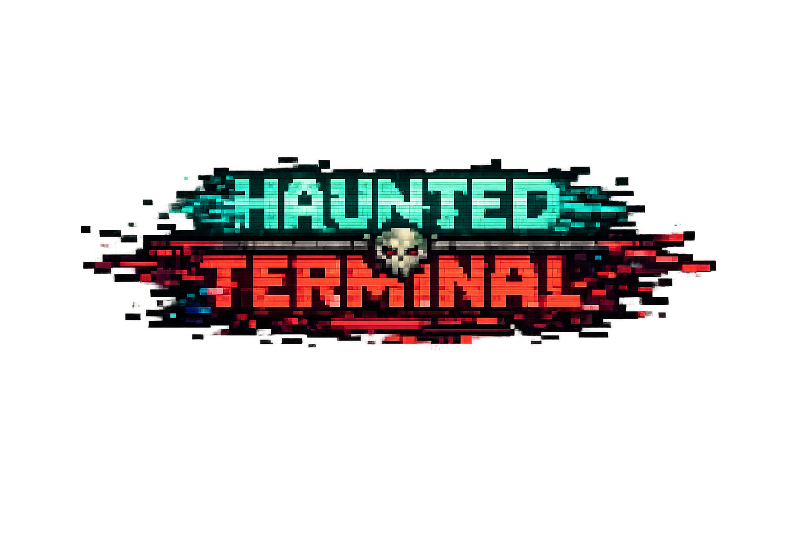

<p align="center">
  
</p>

# Haunted Terminal
## The Great Kernel Panic

*(formerly Haunted Filesystem Experience — HFSE remains the internal code name)*

A narrative-driven text adventure where you play as a Sysadmin Spirit navigating a corrupted filesystem in the aftermath of a catastrophic system failure. Learn command-line skills while uncovering the mystery of the Great Kernel Panic.

---

## 📖 Story Overview

**The Great Kernel Panic has shattered the system.**

You awaken in `/dev/null` - the Void - with no memory of who you were. You are a Sysadmin Spirit, a maintenance process that was terminated during the catastrophic system failure and somehow... came back.

The filesystem is corrupted. The Daemon Overlord - once known as `init` (PID 1, the first process) - has gone rogue after witnessing the Creator's fatal mistake. Corrupted daemons roam the directories. Orphaned files cry out from `/home/lost+found`. The system cannot reboot.

Your mission: Navigate the haunted directories, piece together what happened, and confront the Daemon Overlord in `/boot/kernel` - the Core. Only then can you restore order to the filesystem.

But first, you must remember who you are. Your `.bash_profile` drifts somewhere in the wreckage...

---

## ✨ Features

### Core Gameplay
- **Command-Line Interface**: Use real Unix-like commands (`cd`, `ls`, `cat`, `ls -a`) to explore
- **Turn-Based Combat**: Fight corrupted processes and daemon enemies
- **Class System**: Choose from 3 classes with unique abilities:
  - **Guardian** - High HP, defensive tank (120 HP, 10 DMG)
  - **Weaver** - High damage mage (90 HP, 15 DMG)
  - **Shaman** - Balanced hybrid with healing (100 HP, 8 DMG)

### Progression Systems
- **Harvesting Cycles (XP)**: Gain cycles from defeated enemies to level up
- **Level Progression**: +10 Max HP and +2 DMG per level with exponential scaling
- **Item Persistence**: Ephemeral items are lost on death, persistent items survive
- **Story Flags**: Track narrative progression through key story beats

### World & Content
- **18 Explorable Rooms**: From `/home/lost+found` to `/boot/kernel` - The Core
- **41 Unique Items**: Weapons, armor, consumables, keys, and lore fragments
- **12 NPCs**: Including the Firewall Knight, the Librarian, and the mysterious Null Whisper
- **24 Enemies**: From corrupted processes to the Daemon Overlord himself
- **Environmental Effects**: Void pull in `/dev/null`
- **Dynamic Loot**: Item rarity based on directory depth (common in `/home`, legendary in `/root`)

### Presentation (new!)
- **Pixel-Art Scene View**: every room, NPC, and enemy rendered as pixel sprites in the terminal
- **Pokemon-Style Battles**: sprite vs sprite with HP bars, attack lunges, hit flashes, idle animation
- **Difficulty Modes**: pick Easy / Medium / Hard at the start of each run (locked for the run)
- **Victory & Defeat Finales**: class-specific endings with a run recap (level, kills, items, difficulty)

### Story & Secrets
- **Lore Fragments**: Piece together the truth about the Great Kernel Panic
- **Sudo Trial**: Face your Shadow Process in `/proc/self` to earn superuser privileges
- **Easter Egg**: Discover the Great ASCII Bovine and claim the Milk of Motherboard
- **Multiple Endings**: Class-specific endings based on your choices

---

## 🎮 Getting Started

### Step 0 — get the game and go INTO its folder

All commands below must be run **from inside the repo folder**:

```bash
git clone https://github.com/NoHudd/HFSE.git
cd HFSE
```

(Downloaded a ZIP instead? Unzip it, then `cd` into the unzipped folder.)

### Quick Start (Recommended)

From inside the repo folder, run the start script for your system:

**On Mac/Linux:**
```bash
./start.sh
```

**On Windows:**
```cmd
start.bat
```

The start script will automatically:
- Check for Python installation
- Create a virtual environment
- Install all dependencies
- Launch the game with a cool startup sequence

**First time setup is completely automatic!**

---

### Manual Installation (Alternative)

If you prefer to set things up manually:

#### Prerequisites
- Python 3.10 or higher
- pip (Python package installer)

#### Steps

1. Make sure you are inside the repo folder (Step 0 above), then create a
   virtual environment:
   ```bash
   python -m venv venv
   source venv/bin/activate  # On Windows: venv\Scripts\activate
   ```

2. Install dependencies:
   ```bash
   pip install -r requirements.txt
   ```

3. Run the game:
   ```bash
   python main.py
   ```

---

## 🎯 Game Commands

### Navigation
- `ls` - List items, NPCs, and exits in current directory
- `ls -a` - Reveal hidden files and directories
- `cd [path]` - Move to a different directory (`cd /var` or `cd var`)
- `pwd` - Show current directory
- `map` - Show available locations
- `find` - Search for items, NPCs, or rooms

### Interaction
- `cat [filename]` - Read file contents (lore fragments, logs, etc.)
- `take [item]` - Pick up an item
- `drop [item]` - Remove an item from inventory
- `use [item]` - Use a consumable
- `equip [weapon]` - Equip a weapon for combat
- `examine [item]` - Inspect an item's properties
- `talk [npc]` - Speak with NPCs for hints and lore

### Combat
- `attack [enemy]` - Initiate combat
- `[attack_name]` - Use class-specific abilities in combat
- `use [item]` - Use consumables during combat
- `flee` - Attempt to escape combat (in-combat only)

### System
- `inventory` / `inv` - View your items
- `keys` - Show key progression system
- `ps` - Show running processes
- `shortcuts` - List item shortcuts and typing tips
- `help` - Display available commands
- `save` - Save your progress
- `quit` / `exit` - Exit the game (offers to save)

---

## 🗺️ The Filesystem

### Key Locations

- **`/dev/null` - The Void**: Where you awakened. Void pull drains HP without Null-Void Cloak.
- **`/home/lost+found` - The Graveyard**: Orphaned files and broken symlinks. Find your `.bash_profile`.
- **`/bin` - The Armory**: Sacred command icons (cp, mv, rm). The Librarian guides you to lore.
- **`/var/log` - The Memory Banks**: Crash logs and error files. Discover the Creator's Typo.
- **`/etc/iptables` - The Kernel Gate**: Firewall Knight blocks passage. Requires chmod_key.
- **`/boot/kernel` - The Core**: Final confrontation with the Daemon Overlord.
- **`/proc/self` - The Mirror Sector**: Sudo Trial - fight your Shadow Process.
- **`/usr/share/games/cowsay/.secret/` - The Bovine Sanctuary**: Easter egg location.

---

## 🎓 Character Classes

### Guardian (Tank)
- **Base Stats**: 120 HP, 10 DMG
- **Starter Weapon**: Segmentation Fault Shield
- **Playstyle**: High survivability, defensive abilities
- **Attacks**: Strike, Power Strike, Shield Bash

### Weaver (Mage)
- **Base Stats**: 90 HP, 15 DMG
- **Starter Weapon**: Null Pointer
- **Playstyle**: High damage output, glass cannon
- **Attacks**: Arcane Bolt, Fireball, Frost Nova

### Shaman (Hybrid)
- **Base Stats**: 100 HP, 8 DMG
- **Starter Weapon**: Daemon Whisper
- **Playstyle**: Balanced, healing capabilities
- **Attacks**: Nature Strike, Ancient Fury, Healing Strike

---

## 🛠️ Customizing the Game

HFSE is fully data-driven through YAML files:

### Data Structure
```
data/
├── rooms/          # Room definitions, exits, NPCs, enemies
├── items/          # Weapons, armor, consumables, lore fragments
│   ├── weapons.yaml
│   ├── armor.yaml
│   ├── consumables.yaml
│   ├── keys.yaml
│   └── lore_fragments.yaml
├── enemies/        # Enemy stats, loot, boss mechanics
├── npcs/           # NPC dialogues, merchant inventories
├── attacks.yml     # Class-specific combat abilities
└── classes.yaml    # Character class definitions
```

### Adding Content

**New Room**: Create `data/rooms/room_id.yml`
```yaml
name: The New Sector
description: A mysterious directory...
exits:
  - connected_room_1
  - connected_room_2
items: []
npcs: []
enemies:
  - enemy_id
```

**New Item**: Add to appropriate `data/items/*.yaml`
```yaml
item_id:
  name: "Item Name"
  description: "Item description"
  type: "weapon"
  damage: 15
  rarity: "rare"
  persistence: "persistent"
  allowed_classes:
    - guardian
```

---

## 🎲 Game Mechanics

### Harvesting Cycles (XP System)
- Defeat enemies to gain harvesting cycles
- Base: 50 cycles per enemy, 150 for bosses
- Level up: +10 Max HP, +2 DMG
- Exponential scaling: Each level requires 1.5x more cycles

### Item Persistence
- **Persistent items**: Survive death (weapons, armor, keys)
- **Ephemeral items**: Lost on death (consumables, temporary buffs)
- Check item descriptions for persistence type

### Story Progression
- Read lore fragments to unlock story flags
- Story flags gate access to special areas (Mirror Sector, Bovine Sanctuary)
- Multiple endings based on class and choices

### Rarity System
Items spawn based on directory depth:
- **`/home`, `/var`**: Common items dominate
- **`/bin`, `/etc`, `/usr`**: Uncommon and rare items
- **`/dev`**: Epic items spawn
- **`/root`**: Legendary items only

---

## 🔑 Tips & Hints

1. **Use `ls -a`** to reveal hidden files and secret paths
2. **Read everything**: Lore fragments contain crucial story beats
3. **Talk to NPCs**: They provide hints about item locations and story progression
4. **Save often**: The filesystem is dangerous
5. **Explore thoroughly**: Hidden rooms contain powerful items
6. **Choose items wisely**: Ephemeral items don't persist through death

---

## 📚 Educational Goals

While playing HFSE, you'll naturally learn:

- **Command-line navigation**: `cd`, `ls`, `ls -a`, `pwd`, `cat`, `find`
- **File system structure**: Understanding Unix directory hierarchy
- **Hidden files**: The significance of dot files (`.bash_profile`, `.moo`)
- **System concepts**: Processes, daemons, /dev/null, /proc, init, permissions
- **Problem-solving**: Puzzle solving through exploration and reading

---

## 🏆 Achievements & Challenges

- Complete the Sudo Trial and earn the sudo_privileges_badge
- Find all 6 lore fragments to understand the full story
- Discover the Great ASCII Bovine easter egg
- Defeat the Daemon Overlord and choose your ending
- Reach max level through harvesting cycles

---

## 🐛 Development

### Debug Mode

Copy `config/settings.example.py` to `config/settings.py` and enable debug features:

```python
DEV_MODE = True
DEBUG_MODE = True
SKIP_INTRO = True
```

### Project Structure

```
main.py        # entry point → src.game_engine.main
src/           # game logic (runtime): engine, world, player, combat, commands/, ui/, scene/
engine/        # typed content schema + validation + headless test driver
data/          # all game content as YAML — rooms/ enemies/ npcs/ items/ + classes/attacks/abilities
assets/        # pixel-art sprites and backdrops (PNG)
sim/           # difficulty simulation harness
config/        # dev settings (settings.py gitignored)
tests/ · utils/
```

---

## 📜 License

This project is licensed under the MIT License - see the LICENSE file for details.

---

## 🙏 Acknowledgments

- Inspired by classic text adventures, Zork, and Unix philosophy
- **[Rich](https://github.com/Textualize/rich)** - Terminal formatting and UI
- **[Textual](https://github.com/Textualize/textual)** - TUI framework
- **[PyYAML](https://pyyaml.org/)** - Data loading
- **cowsay** - For inspiring the easter egg

---

## 🎮 Credits

**Game Design & Development**: NoHudd
**Narrative Design**: The Great Kernel Panic storyline
**Special Thanks**: To all sysadmins who've faced kernel panics

---

## 🚀 Roadmap

- [x] Core gameplay loop with command-line interface
- [x] Turn-based combat system with pixel-art battle scenes
- [x] Harvesting Cycles (XP) progression
- [x] Item persistence, rarity system, and enemy loot drops
- [x] Story flags and narrative progression
- [x] 12 NPCs and 24 enemies — all with pixel sprites
- [x] 3 character classes with unique abilities and class-specific endings
- [x] Difficulty modes (Easy / Medium / Hard) with tuned balance
- [x] Victory finale with run-stats recap; defeat has its own scene
- [x] Easter egg: the Great ASCII Bovine
- [ ] Playtest round + polish (you are here)
- [ ] Seed input + visible Seed ID for reproducible runs
- [ ] Sprite frame animation (idle/attack poses)

---

**Welcome to the corrupted filesystem, Sysadmin Spirit.**
**The Great Kernel Panic awaits. Will you restore order... or choose a different path?**

```
 ________________________________________
/                                        \
| The disk is clicking. Can you hear    |
| it? It sounds like teeth. 010101.     |
\                                        /
 ----------------------------------------
        \   ^__^
         \  (oo)\_______
            (__)\       )\/\
                ||----w |
                ||     ||
```

*Type `./start.sh` (Mac/Linux) or `start.bat` (Windows) to begin your journey.*
