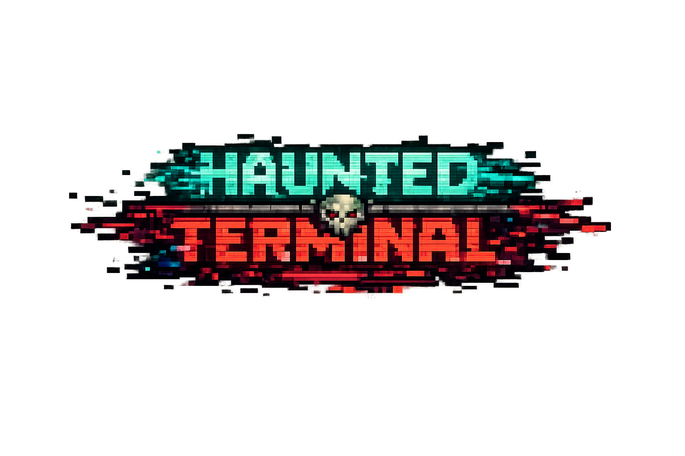
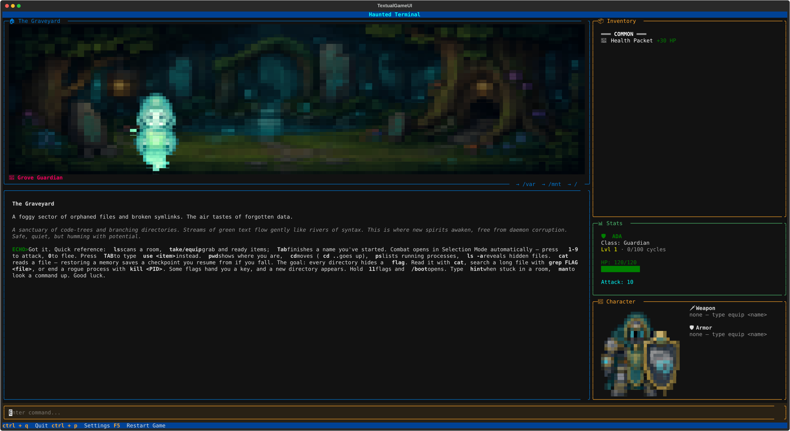
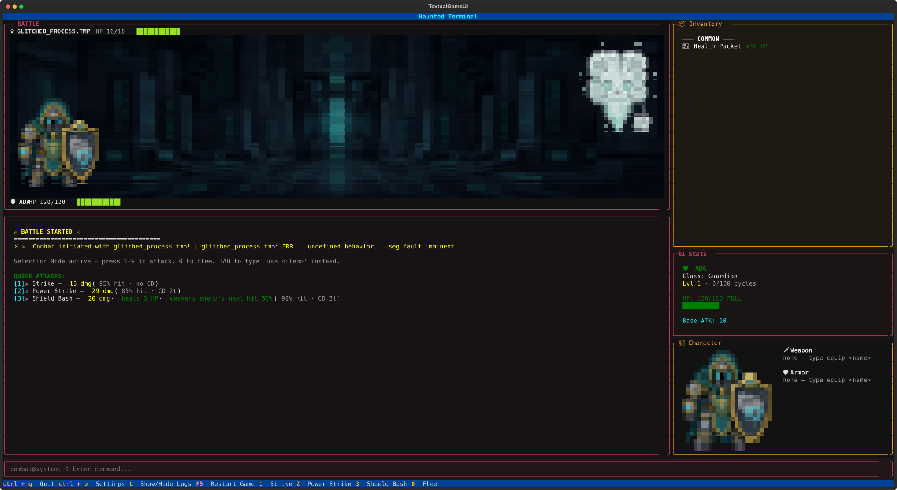
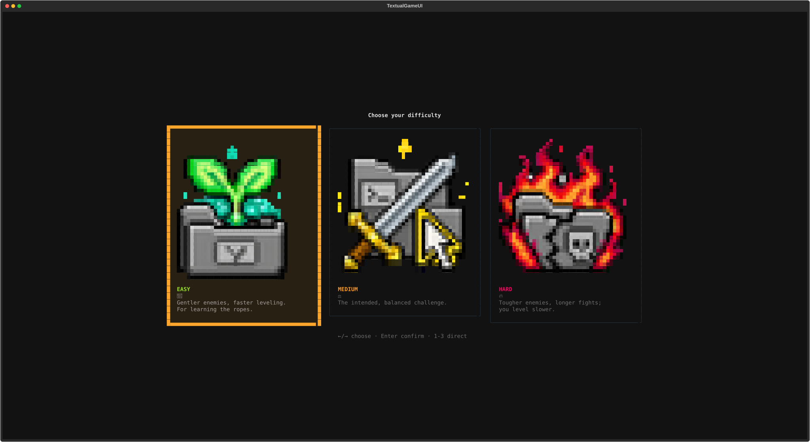
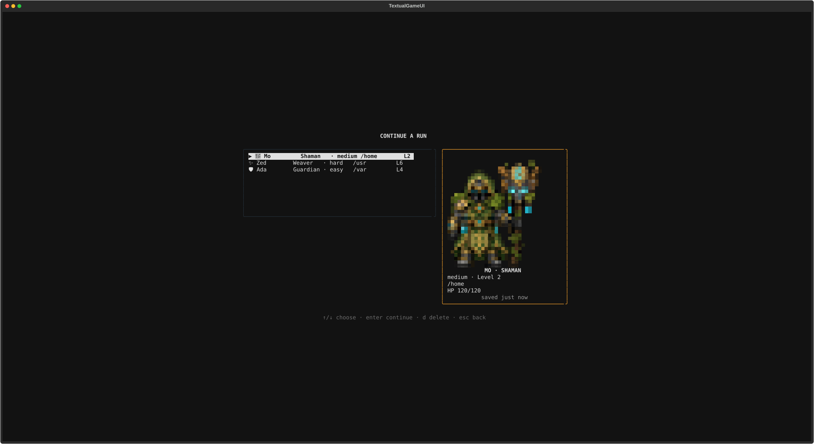
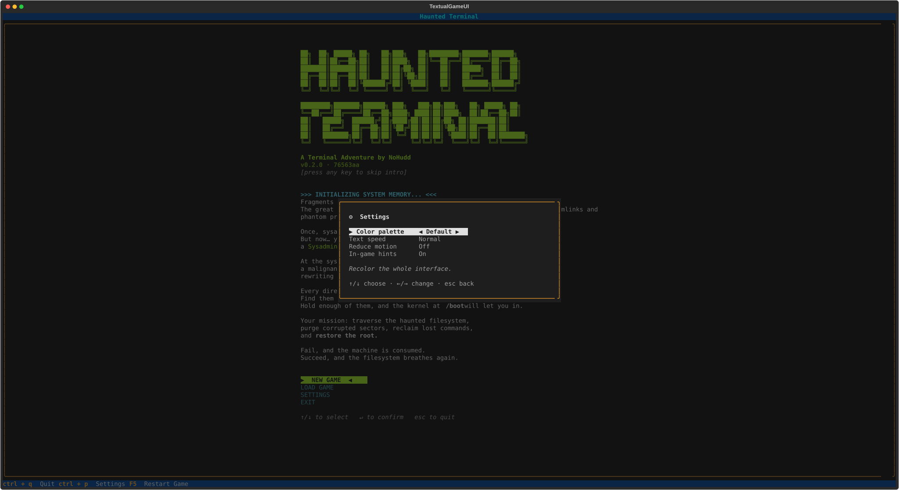

<p align="center">
  
</p>

# Haunted Terminal

You wake up in `/home` with no memory, the last surviving process after a
catastrophic system failure. The filesystem around you is corrupted and haunted
by the daemons of what went wrong. Explore it, fight what's left of it, and
piece together what happened — using real Unix commands (`ls`, `cd`, `cat`,
`pwd`) as your only tools.

The directories are real ones. `cd ..` walks up the tree, `ls -a` shows what is
hidden, and a locked directory doesn't even show up until you hold its key. Type
`man cd` and the game tells you what `cd` does in an actual shell, not just in
here.

Every directory hides a flag. Some you just read with `cat`; some are buried in
huge logs you'll need `grep` to search; some are rogue processes you find with
`ps` and end with `kill`. Some flags hand you a key, and a new directory
appears. Hold 11 flags and `/boot` — where the Daemon Overlord waits — opens.
Stuck? Type `hint`.

No prior command-line experience needed; the game teaches you as you go.

What changed in each version: [CHANGELOG.md](CHANGELOG.md). The version you're
running is on the title screen and on the first line of `debug.log`.

---



_Exploring the Graveyard — pixel scene view, live panels, ECHO's quick reference_

<table>
  <tr>
    <th width="50%">Pokemon-style battles</th>
    <th width="50%">Pick your difficulty</th>
  </tr>
  <tr>
    <td></td>
    <td></td>
  </tr>
  <tr>
    <th>Continue any run — one save slot per run</th>
    <th>Settings — right from the main menu</th>
  </tr>
  <tr>
    <td></td>
    <td></td>
  </tr>
</table>

---

## Getting Started

### Step 0 — download the game and go INTO its folder

On this page click **Code → Download ZIP**
([direct link](https://github.com/NoHudd/hauntedTerminal/archive/refs/heads/main.zip)),
unzip it, then open a terminal in that folder:

```bash
cd hauntedTerminal-main
```

All commands below must be run **from inside the game folder**.

### Quick Start (Recommended)

From inside the game folder, run the start script for your system:

**On Mac/Linux:**

```bash
./start.sh
```

**On Windows:**

```cmd
start.bat
```

The start script automatically checks for Python, creates a virtual
environment, installs dependencies, and launches the game. **First time setup
is completely automatic.**

### Manual Installation (Alternative)

**Prerequisites**: Python 3.10+, pip

```bash
python -m venv venv
source venv/bin/activate  # On Windows: venv\Scripts\activate
pip install -r requirements.txt
python main.py
```

---

Full command list, classes, mechanics and tips live in
**[REFERENCE.md](./REFERENCE.md)** — the game teaches all of it as you play,
so treat that as a lookup, not required reading.

---

## License

This project is licensed under the MIT License — see the LICENSE file for details.

## Acknowledgments

- Inspired by classic text adventures, Zork, and Unix philosophy
- **[Rich](https://github.com/Textualize/rich)** — terminal formatting and UI
- **[Textual](https://github.com/Textualize/textual)** — TUI framework
- **[PyYAML](https://pyyaml.org/)** — data loading
- **cowsay** — for inspiring the easter egg

## Credits

**Game Design & Development**: NoHudd
**Narrative Design**: The Great Kernel Panic storyline
**Pixel art**: AI-generated, hand-picked and resized
**Special Thanks**: To all sysadmins who've faced kernel panics

---

```
 ________________________________________
/                                        \
| The disk is clicking. Can you hear    |
| it? It sounds like teeth. 010101.     |
\                                        /
 ----------------------------------------
        \   ^__^
         \  (oo)\_______
            (__)\       )\/\
                ||----w |
                ||     ||
```
